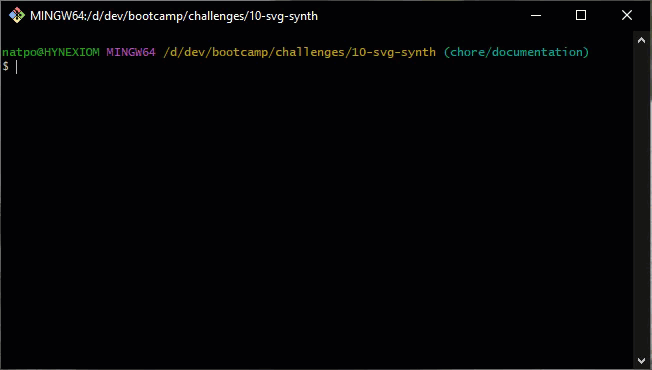
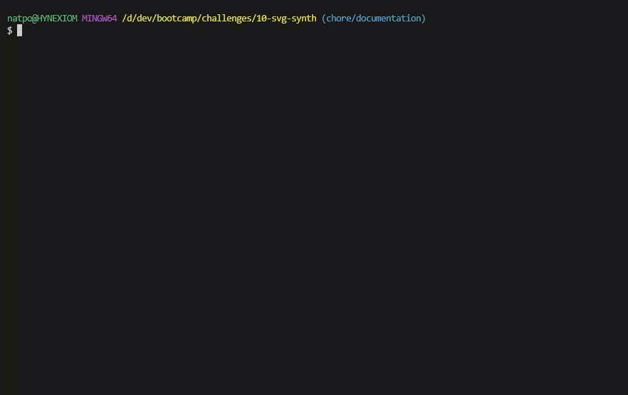

# SVG Synth
A simple app for generating Scaleable Vector Graphics with some text. This app was produced as part of the Coding Bootcamp from the University of Sydney and edX.

The primary motivation for developing this app was to create something that would quickly and easily condense the process of writing an SVG file to a few user prompts. It accomplishes this by condensing shape generation to a set of classes, which then return SVG markup to be output to a file.

This version of the app employs simplified prompts for generating SVGs and only prompts for a shape, shape colour, and font colour, with flexibility to expand the modifications to all aspects of the SVG in future versions.

The biggest challenge was handling the input from both an app perspective and a testing perspective. Testing would've required the use of Jest Mock functions, and their implementation was too much to work with given the time constraint. Additionally, there was some back and forth when implementing the prompts, since there were little options for providing a tidy output. There is supposdedly an inquirer test API, but this is only available in the ES6 rewrite of the app.

Initially the inquirer-tree-selection module was used, with the hope being to categorise the selections by their base hue, however for reasons that still elude me, it failed to return the object array, despite using what appeared to be valid syntax. In the end, better results were acccomplished via the use of the inquirer-search-list module.

Some of the areas for improvement I'd like to target for future releases include:
- Implement advanced prompts for fine-grain control over the final output, this would be in the form of a selection list to specify what values should be modified, then a sequence of prompts to extract the values (ran out of time to implement this during the project)
- Implement some tests for inquirer so there can be some additional rigour put around it
- Add a colour preview swatch in the prompt, either at the bottom of the console in the status bar or in-line with the options

## Table of Contents
- [Usage](#usage)
- [Installation](#installation)
- [Usage](#usage)
- [Tests](#tests)
- [Credits](#credits)
- [License](#license)

## Installation
To use SVG Synth, clone the git repository locally and run `npm install` to obtain the required modules.

## Usage
Once installed, run `node index.js` from in the repo folder. The app is console-based and will ask you four questions:

1. Selecting a shape to use
2. Selecting a shape colour to use
3. Selecting a font colour to use
4. Specifying up to 3 characters to enter as the text

Once you've provided these answers, an SVG will be generated in `./dist/output.svg` with the final markup.

A demonstration of this process can be found in the GIF below:



## Tests
The following test suites have been provided for the app, and evaluates the Shapes and Generate modules. As stated above, Prompt is not tested because of difficulties implementing tests that work with its interactive nature.

Tests can be initiated with the following line:

```
npm run test
```

This will initiate the jest testing suite if you have installed all the node modules required. The following tests are performed:

- Shapes
    - Shape
        - has a colour property, and returns a default colour from empty declaration
        - has a text property, and returns an empty string from empty declaration
        - has a font property, and returns a default font object from empty declaration
        - has a font setter, which configures the values of the text size, position, and alignment
        - has a text setter, which only updates if there's 3 letters or less
        - contains a draw() function that returns "Not implemented"
        - has a static render() method, which returns formatted SVG markup, and the formatted output of the passed Shape
    - Square
        - inherits from Shape
        - has a start property
        - start property contains an x,y object with default co-ordinates
        - has a dimensions property
        - dimensions property contains an x,y object with default pixel sizes
        - has a custom implementation of draw(), which returns a formatted XML string of both the square and text
    - Circle
        - inherits from Shape
        - has a centre property
        - centre property contains an x,y object with default co-ordinates
        - has a radius property
        - radius property contains a number with a default value
        - has a custom implementation of draw(), which returns a formatted XML string of both the circle and text
    - Triangle
        - inherits from Shape
        - default instantiation overrides the default font size and position values
        - has a points property
        - points property contains three numbered properties with x,y co-ordinates as arrays
        - has a custom implementation of draw(), which returns a formatted xml string of both the triangle and the text
- Generate
    - SVG File Generation
        - a file called "testOutput.svg" should be created when generateSVG() is called
        - the contents of "testOutput.svg" should match the output of Shape.render()
        - an error should be thrown if you attempt to specify a path that doesn't exist

The following GIF demonstrates the tests being executed, and their results.



## Credits
### Code and Extensibility
- Testing suite: [jest](https://github.com/jestjs/jest)
- Prompt module: [inquirer](https://www.npmjs.com/package/inquirer)
- List filtering module for inquirer: [inquirer-search-list](https://github.com/robin-rpr/inquirer-search-list)
- Platform: [Node.js](https://nodejs.org/en)
### References
- HTML Colour Keywords: [HTML Colour Codes](https://htmlcolorcodes.com/color-names/)
- SVG Documentation: [Mozilla Developer Network](https://developer.mozilla.org/en-US/docs/Web/SVG/Element/svg)

## License
This project is provided under the [MIT License](./LICENSE)
